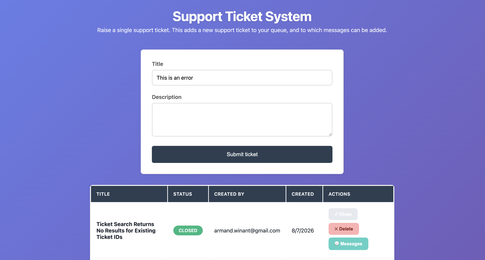

# Lakebase-Powered AI Support App



[Databricks App](https://support-ticket-system-7474646616445687.aws.databricksapps.com)

Web support application where users can create support tickets and add messages to those tickets 
- Open new tickets by entering a title and description. 
- View your queue of opened tickets and their status.
- Add messages to existing tickets.

# Technologies in use / Tech Stack / Built with

- Python
- Flask
- SQL
- HTML/CSS/JS
- Lakebase

# Installation

### 1. Create a Lakebase instance and a native-password role

1. In your Databricks workspace, go to **Catalog** (left sidebar) and select the **Lakebase** tab (or search "Lakebase" in the workspace search bar).
2. Click **Create Lakebase instance** (sometimes labeled **Create database instance**).
   - Give it a name (e.g. `support-ticket-db`).
   - Choose the capacity/compute size and region appropriate for your workload (defaults are fine to start).
   - Click **Create** and wait for the instance to reach the **Available**/**Running** state.
3. Open the newly created instance, then go to the **Roles & Databases** tab (sometimes called **Permissions** or **Roles**).
4. **Enable native (password) authentication** for the instance if it isn't already on:
   - Look for an authentication setting such as **Native passwords** or **Password authentication** and toggle/enable it. By default some Lakebase instances only support OAuth/token-based auth — you need password auth enabled so the role below gets a static password instead of a short-lived token.
5. **Create a new role**:
   - Click **Add role** / **Create role**.
   - Choose **Password** as the authentication method (not OAuth).
   - Name the role (e.g. `user`) and let Databricks generate (or set) a password.
6. **Copy the connection URL** shown for the role. It will look like:

   ```
   postgresql://<role>:<password>@<host>.database.cloud.databricks.com:5432/databricks_postgres?sslmode=require
   ```

   Keep this URL — you'll paste it into `setup_secrets.py`'s prompt in the next step.

### 2. Store your secrets

Run once from a **Databricks notebook** in your workspace (no CLI needed):

1. Create a new notebook (or open the Git folder you'll create in step 5, once it's cloned) and attach it to any running cluster.
2. In a cell, run:

   ```python
   %sh python setup_secrets.py
   ```

   or open a terminal from the notebook (**Run** > **Open terminal**, if enabled on your cluster) and run `python setup_secrets.py` there.

This prompts (via `getpass`, so nothing is echoed or written to disk/shell history) for your **Lakebase connection URL** (from step 1) → stored as secret `database/lakebase-url`

### 3. Configure environment variables (local dev)

Copy `.env.example` to `.env` and paste your Lakebase URL as `LAKEBASE_URL` for local runs:

```bash
cp .env.example .env
```

For deployment, `app.yaml` already pulls `LAKEBASE_URL` from the `database/lakebase-url` secret automatically — no manual editing needed there.

### 4. Install dependencies

```bash
pip install -r requirements.txt
```

### 5. Run locally

```bash
python app.py
```

### 6. Create a Git folder in Databricks and deploy the app (no CLI required)

All of this is done through the Databricks workspace UI:

1. **Create a Git folder**:
   - In the Databricks workspace sidebar, click **Workspace** > **Create** > **Git folder** (in older UIs this is called **Repos** > **Add Repo**).
   - Paste the Git URL of this project's repository (e.g. your GitHub/GitLab remote for this codebase).
   - Choose a folder name and click **Create Git folder**. Databricks will clone the repo directly into your workspace — this becomes the source for your app.

2. **Create the Databricks App**:
   - In the sidebar, go to **Compute** > **Apps** (or search "Apps" in the workspace search bar).
   - Click **Create app**, then choose **Custom** (or "From scratch").
   - Give the app a name (e.g. `support-ticket-system`).

3. **Point the app at your Git folder**:
   - When prompted for the source code location, select **Workspace files** / **Git folder** and browse to the Git folder you created in step 1 (the folder containing `app.py` and `app.yaml`).
   - Databricks will read `app.yaml` from that folder automatically to configure the `command` and `env` (including the `LAKEBASE_URL` and secret scope/key references).

4. **Deploy**:
   - Click **Deploy** (or **Create and deploy**) in the Apps UI. Databricks will build and start the app using the Git folder's current contents — no `databricks` CLI commands are needed.
   - Whenever you update the code, pull the latest changes into the Git folder (**Git folder** > **Pull**, via the UI) and click **Deploy** again in the Apps UI to redeploy.

5. Once deployed, open the app's URL from the Apps UI and hit `GET /healthz` to confirm it's running.

# What I have learned

This project was my introduction to the Databricks platform, and how to build full-stack applications on it. The focus was on the use of Lakebase, the OLTP database solution offered on Databricks. I learned how to set up a new database, configure password-based access, and build an API that interacts with it.

# What issues have I faced and how I resolved them

It took some time for me to get a clear overview of the different services and functionalities offered on the Databricks platform, and which were relevant to my project. I needed to research and compare the different storage solutions and their use cases. Lakebase is Databricks' OLTP solution and is based on Postgres. It is optimized for production databases requiring frequent small reads/writes with low-latency, so as not to impact the user experience.

# Source

This project is done as part of [the Rise of the AI Data Engineer bootcamp](https://learn.dataexpert.io/program/the-one-week-beginners-databricks-boot-camp-7129) curriculum. 
